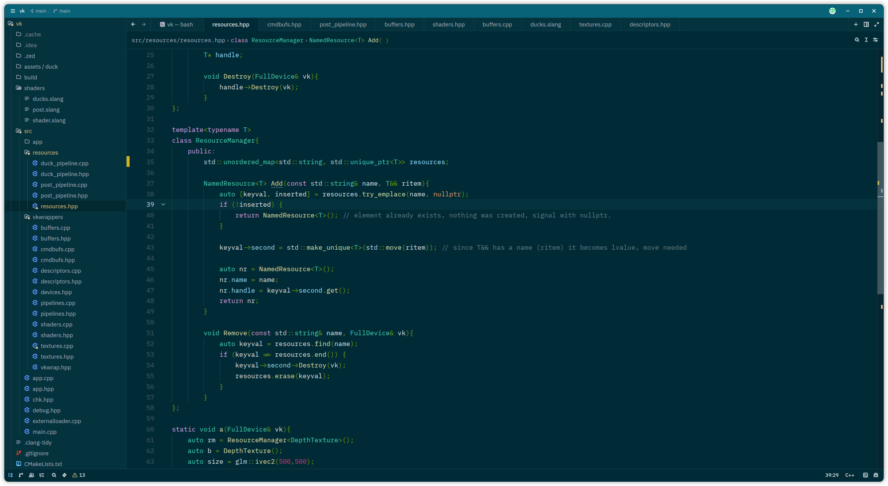
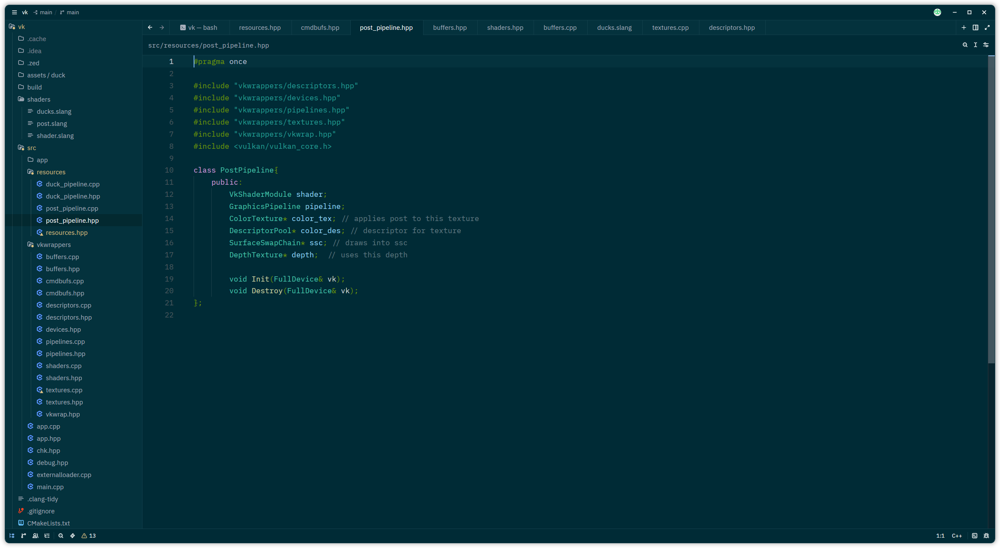
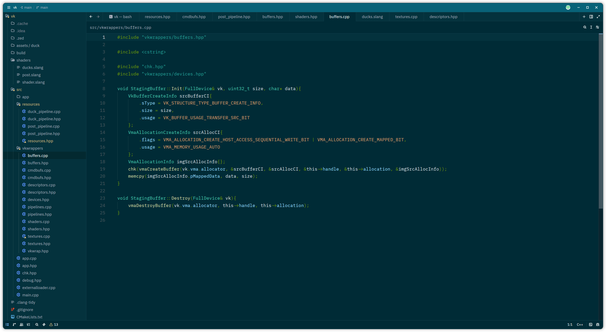
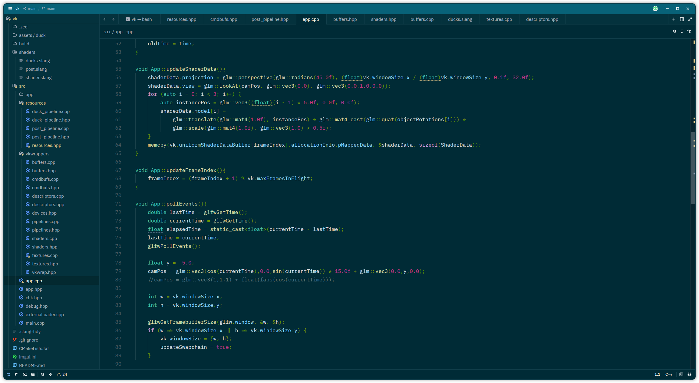

# ms-solarized-dark-zed
This theme was inspired by the Solarized Dark theme from Microsoft's [Theme Pack](https://marketplace.visualstudio.com/items?itemName=idex.vsthemepack) for Visual Studio.

The theme was mainly designed for C++ use.

The theme has 2 versions:
- Ms Solarized Dark
- Ms Solarized Dark Vibrant

The Vibrant version is mostly for IPS screens, while the normal version looks best on OLED screens.

Personally, I ping-ponged between a lot of themes, but the Theme from MS's Theme Pack just stuck with me. All the other Solarized themes seem too dark and unsaturated for my displays and eyes. My theme is good for both day and night work. I can also retain a lot focus with this theme and a lot of hard work was done with it selected.

Here's how it (the normal theme) looks inside Zed:

